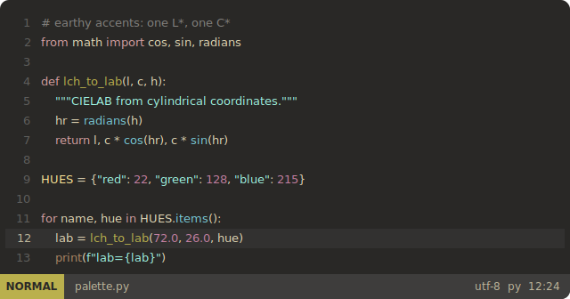
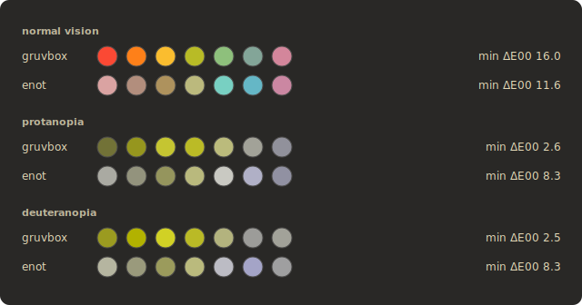
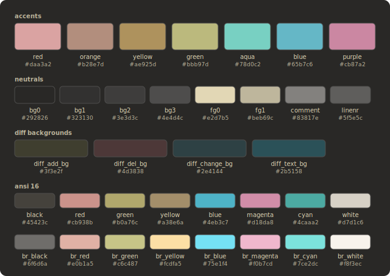

# enot

An earthy colorscheme that survives color blindness. Dark and light,
gruvbox character, every color generated in CIELAB - and machine-checked:
minimum pairwise dE00 8.2 between syntax accents and 7.2 across the
16 ANSI colors, measured under simulated protanopia and deuteranopia
on every build.

<picture>
  <source media="(prefers-color-scheme: light)" srcset="docs/assets/editor-light.svg">
  
</picture>

Live vision switcher, install pages and the numbers:
https://enot-theme.github.io/

## Why

Warm themes encode meaning almost purely by hue, and dichromacy folds
the warm hues into one ochre band: gruvbox drops to dE00 2.5 between
its closest accents, enot holds 8.3. The strip is generated by the same
pipeline that computes the theme; the site runs the simulation live.

## Palette

<picture>
  <source media="(prefers-color-scheme: light)" srcset="docs/assets/palette-light.svg">
  
</picture>

The specification is data: [colors.json](colors.json) carries every role
at three depths (true color, xterm-256, ANSI slot) with the measured
metrics embedded.

## Install

- [vim / neovim](https://enot-theme.github.io/vim/): copy [vim/colors/enot.vim](vim/colors/enot.vim) into `~/.vim/colors/` or `~/.config/nvim/colors/`;
- [WezTerm](https://enot-theme.github.io/wezterm/): copy [wezterm/*.toml](wezterm) into `~/.config/wezterm/colors/`;
- [Midnight Commander](https://enot-theme.github.io/mc/): copy [mc/*.ini](mc) into `~/.local/share/mc/skins/`;
- [ranger](https://enot-theme.github.io/ranger/): copy [ranger/colorschemes/enot.py](ranger/colorschemes/enot.py) into `~/.config/ranger/colorschemes/`.

## Add a port

One spec renders every port under [ports/](ports): a port is a directory
with a `port.json` manifest - a `${var}` template (no code), a small
`render.py` for formats that need logic, or a verbatim file. The build
renders it, registers it on the [coverage matrix](https://enot-theme.github.io/apps/)
and checks that every color literal in every output belongs to the spec.

## Method

- [docs/enot.en.md](docs/enot.en.md) - the method on one page;
- [the site](https://enot-theme.github.io/) - invariant tables per depth and the live dichromacy switcher;
- `make help` - the pipeline; `make build` reproduces every artifact from the spec and runs the regression.
